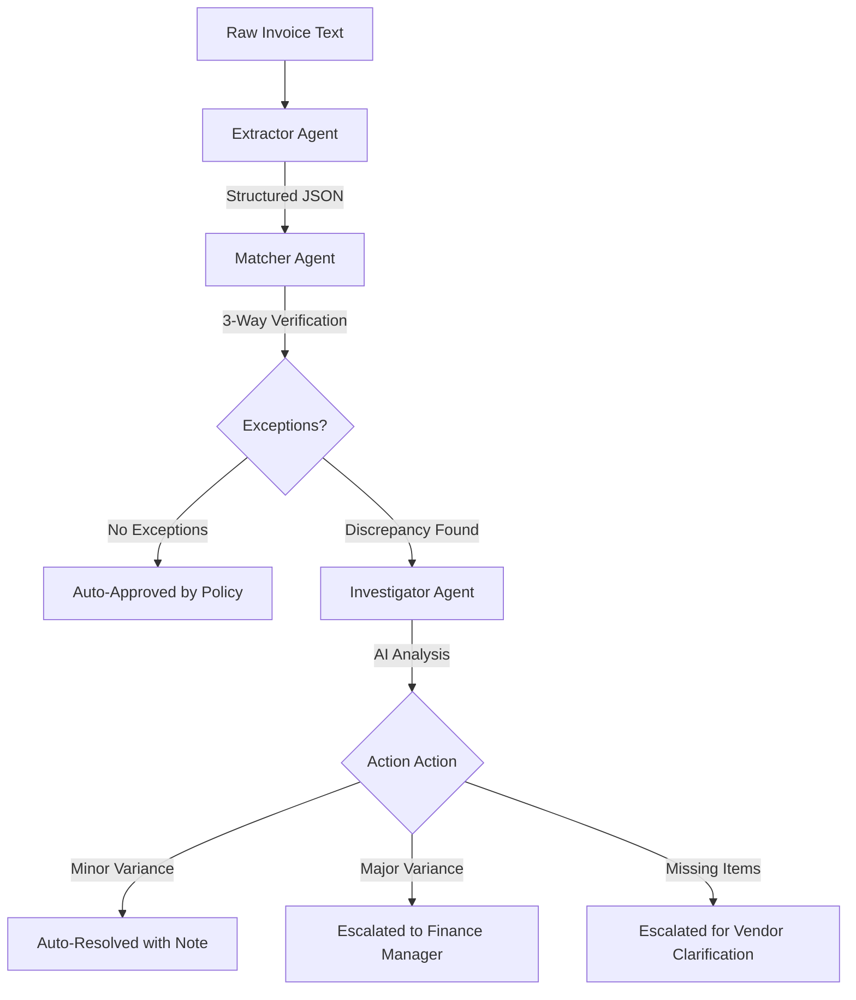

# AP Exception Resolution Agent 🛡️💼

An intelligent accounts payable automation platform designed to process raw invoices, validate them against purchase orders and goods receipts, and automatically resolve matching discrepancies using a multi-agent AI pipeline.

---

## 🏗️ Architecture & Pipeline Flow

The system runs a sequential three-agent pipeline to audit each invoice:



1.  **Extractor Agent**: Parses unstructured invoice text (OCR output) into structured JSON formats using Gemini Structured Outputs.
2.  **Matcher Agent**: Performs a strict 3-way match checking unit price, quantities, and items against the Purchase Order and Goods Receipt.
3.  **Investigator Agent**: Evaluates detected discrepancies using Gemini reasoning to recommend root causes and resolution statuses (Approved, Escalated, or Clarified).

---

## 🛠️ Technology Stack

*   **Backend**: Python 3.12, FastAPI (REST API), Uvicorn (ASGI Server), Pydantic (data validation)
*   **AI Engine**: Gemini 2.5 Flash (`google-genai` SDK)
*   **Database**: Google Cloud Firestore (Firebase Admin SDK) with an automatic `InMemoryDB` fallback.
*   **Frontend**: Next.js 14 (App Router), TypeScript, Tailwind CSS, Lucide icons
*   **Testing**: Pytest (automated test coverage with isolated database/API mocks)

---

## 📁 Repository Structure

```text
ap-exception-resolution-agent/
├── backend/                  # FastAPI Application
│   ├── main.py               # API Gateway & CORS Setup
│   ├── agents/               # Extractor, Matcher, Investigator Agents
│   ├── models/               # Pydantic Schemas
│   ├── services/             # Gemini Client & Firestore Client Wrappers
│   ├── policy/               # Unit-cost variance allowance rules
│   ├── data/                 # Seeding scripts & synthetic JSON data
│   ├── tests/                # Automated pytest files
│   ├── requirements.txt      # Python Dependencies
│   └── deploy.md             # Render Blueprint guidelines
├── frontend/                 # Next.js Application
│   ├── app/                  # App Router Pages (Dashboard, Details, Upload)
│   ├── components/           # Reusable UI elements (Timeline, Panels)
│   ├── lib/                  # Typed API Client & interfaces
│   └── README.md             # Vercel deployment guidelines
└── README.md                 # Project Overview (This file)
```

---

## 🚀 Local Development Setup

### Prerequisite Environment Variables
Before running the project locally, create `.env` files in both directories.

*   **Backend (`backend/.env`)**:
    ```env
    GEMINI_API_KEY=your_gemini_api_key
    FIREBASE_CREDENTIALS_PATH=firebase-credentials.json
    ```
*   **Frontend (`frontend/.env.local`)**:
    ```env
    NEXT_PUBLIC_API_URL=http://localhost:8000
    ```

---

### Step 1: Start the Backend API

1. Navigate to the backend folder:
   ```bash
   cd backend
   ```
2. Create and activate a Python virtual environment:
   ```bash
   python -m venv venv
   # On Windows:
   .\venv\Scripts\activate
   # On macOS/Linux:
   source venv/bin/activate
   ```
3. Install dependencies:
   ```bash
   pip install -r requirements.txt
   ```
4. Seed the database (optional - loads synthetic PO/GR records):
   ```bash
   python data/load_to_firestore.py
   ```
5. Spin up the development server:
   ```bash
   uvicorn main:app --reload
   ```
   * The backend will run at `http://localhost:8000`. Access Swagger docs at `http://localhost:8000/docs`.

---

### Step 2: Start the Next.js Frontend

1. Navigate to the frontend folder:
   ```bash
   cd ../frontend
   ```
2. Install Node modules:
   ```bash
   npm install
   ```
3. Spin up the Next.js dev server:
   ```bash
   npm run dev
   ```
   * The UI will load at `http://localhost:3000`.

---

## 🧪 Running Automated Tests

A comprehensive unit and integration test suite is located in the `backend/tests/` directory.

To execute the backend test suite:
```bash
cd backend
.\venv\Scripts\pytest -v
```

---

## ☁️ Production Deployment Links

*   **Deployed Backend Service**: [Render Web Service](https://ap-exception-resolution-agent.onrender.com/health) (Uvicorn + FastAPI + Firestore)
*   **Deployed Frontend Client**: [Vercel Production Site](https://ap-exception-resolution-agent.vercel.app/) (Next.js + Tailwind)

For cloud deployment details, review [backend/deploy.md](file:///d:/kaggle/backend/deploy.md) (Render Blueprints) and [frontend/README.md](file:///d:/kaggle/frontend/README.md) (Vercel instructions).
